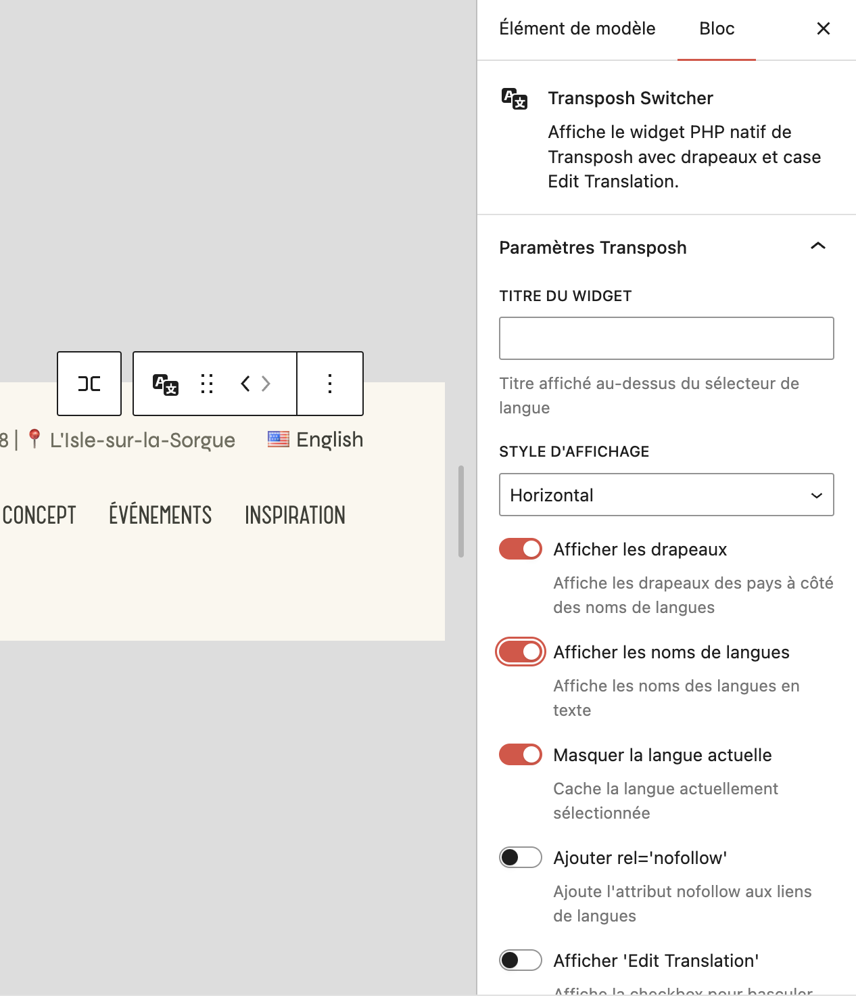

# Transposh FSE Language Switcher Block

A dynamic Gutenberg block to display the native Transposh language selection widget, fully compatible with Full Site Editing (FSE).

## Description

This block allows easy integration of the Transposh language selector into the Gutenberg editor and WordPress Site Editor. It provides all the functionality of the native Transposh widget with a modern, configurable interface that seamlessly integrates with WordPress's block-based editing experience.

## Features

- **3 display styles**: Horizontal, Vertical, Dropdown menu
- **4 flag libraries**: FlagCDN (PNG), Flag Icons (SVG), Emoji natives, Twemoji (SVG)
- **Complete customization**: Flags, language names, custom title
- **Edit mode**: "Edit Translation" checkbox for manual translation
- **Advanced options**: Hide current language, nofollow attribute
- **FSE compatible**: Works in WordPress Site Editor
- **WYSIWYG**: Non-clickable preview in editor, fully functional on frontend
- **Robust**: Error handling and security checks
- **Multilingual interface**: Supports multiple languages with Poedit compatibility
- **Realistic preview**: Real country flags and language names in the editor

## Screenshots

### Block Preview in Gutenberg Editor
The block shows a realistic preview with actual country flags and language names:


### Block Settings Panel
Complete control over the language switcher appearance and behavior:



## Installation

### Option 1: Theme Integration (Recommended)
1. Ensure the **Transposh** plugin is installed and activated
2. Copy the `transposh` folder to `/wp-content/themes/your-theme/blocks/`
3. Add the block inclusion to your theme's `functions.php`:

```php
// Include Transposh FSE Block
if (file_exists(get_template_directory() . '/blocks/transposh/transposh.php')) {
    require_once get_template_directory() . '/blocks/transposh/transposh.php';
}
```

### Option 2: Plugin Integration
This block can be integrated directly into the Transposh plugin by:
1. Adding the block files to the plugin's directory structure
2. Registering the block in the plugin's main file
3. Enqueueing the block assets with the plugin's other scripts

## Usage

### In Gutenberg Editor:
1. Search for "Transposh Switcher" in the block library
2. Insert the block into your content
3. Configure settings in the right sidebar

### In Site Editor (FSE):
1. Open WordPress Site Editor
2. Add the "Transposh Switcher" block to your templates
3. Customize according to your needs

### Block Settings

| Setting | Type | Default | Description |
|---------|------|---------|-------------|
| **Widget Title** | Text | Empty | Title displayed above the language selector |
| **Display Style** | Select | Horizontal | Horizontal, Vertical, or Dropdown menu |
| **Show Flags** | Toggle | Yes | Display country flags |
| **Flag Library** | Select | FlagCDN | Choose flag icons library (when flags enabled) |
| **Show Language Names** | Toggle | Yes | Display language names as text |
| **Hide Current Language** | Toggle | No | Hide the currently selected language |
| **Add rel='nofollow'** | Toggle | Yes | Add nofollow attribute to language links |
| **Show 'Edit Translation'** | Toggle | Yes | Display edit mode checkbox |

### Flag Libraries

The block supports 4 different flag icon libraries:

| Library | Type | Source | Best For |
|---------|------|---------|----------|
| **FlagCDN** | PNG | flagcdn.com | General use, fast loading |
| **Flag Icons** | SVG | flagicons.lipis.dev | Modern designs, scalability |
| **Emoji** | Unicode | Native system | Performance, compatibility |
| **Twemoji** | SVG | Twitter emojis | Visual consistency |

## Requirements

- WordPress 6.6+
- PHP 7.2+
- Transposh plugin installed and configured

## Supported Languages

The block includes translations for:
- **English** (en_US) - Default
- **French** (fr_FR) - Français
- **Spanish** (es_ES) - Español

### Adding New Languages

To add a new language translation:

1. Copy the `languages/transposh.pot` template file
2. Create a new `.po` file: `transposh-[locale].po` (e.g., `transposh-de_DE.po`)
3. Translate the strings using **Poedit** or any `.po` editor
4. Compile the `.mo` file
5. Place both files in the `languages/` directory

The translation domain used is `transposh`, ensuring compatibility with the original Transposh plugin.

## Technical Details

### Block Structure
```
blocks/transposh/
├── build/                 # Compiled files
├── src/                   # Source files
│   ├── edit.js           # Block editor interface
│   ├── block.json        # Block configuration
│   └── *.scss           # Styles
├── languages/            # Translation files
├── render.php           # Server-side rendering
├── transposh.php        # Block registration
└── package.json         # Build configuration
```

### Rendering
The block uses server-side rendering (`render.php`) to ensure compatibility with all Transposh features and settings. The editor preview is a non-clickable representation that updates in real-time as settings change.

### Security
- Input sanitization for all attributes
- Permission checks for edit translation feature
- Graceful fallback when Transposh plugin is not available

## Integration with Transposh Plugin

This block is designed to work seamlessly with the existing Transposh plugin:
- Uses the same translation domain (`transposh`)
- Respects all Transposh settings and configurations
- Maintains compatibility with existing Transposh features
- Follows WordPress coding standards and best practices

## Development

### Building the Block
```bash
npm install
npm run build
```

### Development Mode
```bash
npm run start
```

## Contribution

This block was developed to enhance the Transposh plugin's integration with modern WordPress block editing. It could be integrated into a future version of Transposh to provide users with a native block-based language switching experience.

## Documentation

For detailed technical documentation, troubleshooting guides, and development information, see the [`docs/`](docs/) folder:

- **[Technical Documentation](docs/README.md)** - Complete technical documentation
- **[Flag Libraries Guide](docs/GUIDE_LIBRAIRIES_DRAPEAUX.md)** - Guide for flag icon libraries
- **[Integration Guide](docs/INTEGRATION.md)** - Integration instructions
- **[Troubleshooting](docs/FIX_CONFIG_FILE_ERROR.md)** - Common issues and fixes

## License

GPL-2.0-or-later - Same as WordPress and Transposh plugin

## Author

Developed by Frédéric Galliné  
Version: 1.0.0

---

*This block follows all WordPress best practices and integrates perfectly with the FSE system, making it an ideal addition to the Transposh plugin ecosystem.*
